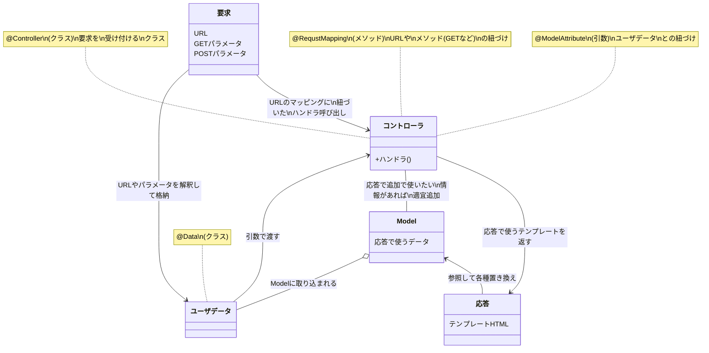

# DI

## Bean
DIコンテナに格納されるオブジェクト。JavaBeansというわけではない。
暗黙的にインタフェース。
## Beanの定義
クラス定義の前にアノテーションを使う。
@Controller, @Service, @Repository, @Componentなど
## Beanのインスタンス化
DIする側、される側の両方がBeanである必要がある。
```java
// @AutoWiredのバターン1（推奨）
@Component //など　↓もどこかでDIされる側になる。
public class SampleClass {
    private final ExampleClass exampleClass; //finalつき

    @Autowired
    public SampleClass(ExampleClass exampleClass){
        //ExampleClassも@Componentなど付きで定義されたもの
        //Framework側でnewしてくれたものがもらえる。(new不要)
        this.exampleClass = exampleClass
    }
		
// @AutoWiredのバターン2
@Component //など　↓もどこかでDIされる側になる。
public class SampleClass {
    private ExampleClass exampleClass;

    @Autowired
    public void setExampleClass(ExampleClass exampleClass){
        //ExampleClassも@Componentなど付きで定義されたもの
        //Framework側でnewしてくれたものがもらえる。(new不要)
        this.exampleClass = exampleClass
    }

// @AutoWiredのバターン3
@Component //など　↓もどこかでDIされる側になる。
public class SampleClass {
    @Autowired
    private ExampleClass exampleClass;
    //ExampleClassも@Componentなど付きで定義されたもの
    //Framework側でnewしてくれたものがもらえる。(new不要)

// @RequiredArgsConstructorのバターン（やってることは@AutoWiredのバターン1と同じ）
import lombok.RequiredArgsConstructor;
@RequiredArgsConstructor
public class SampleClass {
    private final ExampleClass exampleClass;
    //↑private finalのメンバ変数がインスタンス化対象
    //コンストラクタ定義不要
```

# MVC

